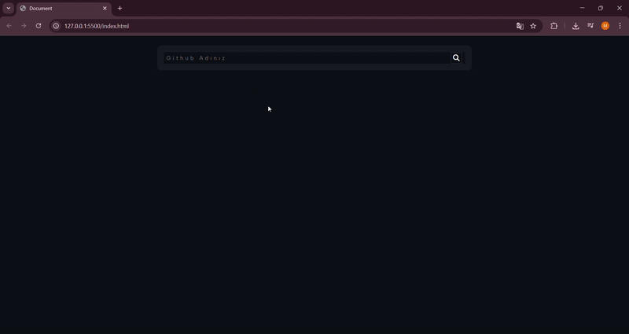

<h1> Github Search Users Projesi </h1>

<h2> Githup projesi inputa giridiğimiz değer doğrultusunda bize github kullanıcısını  arayüze bir cart şeklinde bastıran bir sayfadır. Bu projede veri çekme axios ile yapıldı. HTML CSS ve Javascript kullanıldı
</h2>

